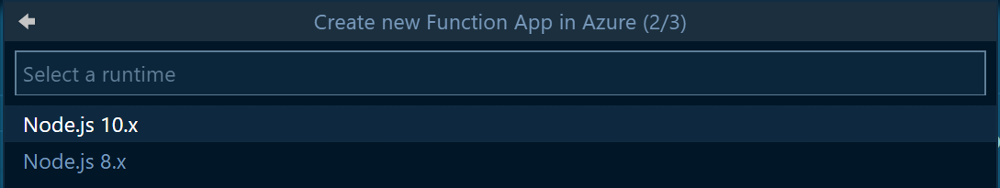
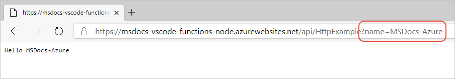

# Deploy the Functions app

[Previous step: Test the function locally](tutorial-vscode-serverless-node-03.md)

1. In VS Code, select the Azure logo to open the **Azure Explorer**, then under **Functions**, select the blue up arrow to deploy your app:

    

    Alternately, you can deploy by opening the **Command Palette** (**F1**), entering 'deploy to function app', and running the **Azure Functions: Deploy to Function App** command.

1. At the prompt, **Select Function App in Azure**, choose **Create new Function app in Azure**.

1. At the next prompt, enter a globally unique name for your Function App and press **Enter**. Valid characters for a function app name are 'a-z', '0-9', and '-'.

1. Then choose the Node.js version/runtime 

    

1. At the next prompt, select an Azure [region](https://azure.microsoft.com/regions/) close to you.

1. The VS Code **Output** panel for **Azure Functions** shows progress:

    

1. Once deployment is completed, go to the **Azure Functions** explorer, expand the node for your Azure subscription, expand the node for your Functions app, then expand **Functions (read only)**. Right-click the function name and select **Copy Function Url**:

    

1. Paste the URL into a browser, and append a `?name=<yourname>` argument. The browser should then show the function running in the cloud:

    

1. If you want, make some changes to the function code in *index.js* or add additional functions with other triggers. After testing locally, deploy the code again as in the earlier steps to test those changes in the cloud.

    > [!TIP]
    > When deploying, the entire Functions application is deploy so changes to all individual Functions will be deployed at once.

> [!div class="nextstepaction"]
> [I deployed the Function app](tutorial-vscode-serverless-node-05.md) [I ran into an issue](https://www.research.net/r/PWZWZ52?tutorial=node-deployment-azurefunctions&step=deploy-app)
