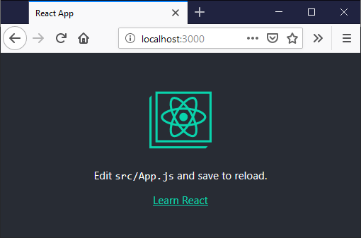

# Create the app

[Previous step: Introduction and prerequisites](tutorial-vscode-static-website-node-01.md)

In this step, you use the React utility CLI, [create-react-app](https://github.com/facebook/create-react-app), to create a simple React app that can be deployed to Azure. You can alternately use Angular, Vue, another framework, or any folder that contains a few HTML files. If you already have an app ready to deploy, you can skip ahead to [Create an Azure Storage account](tutorial-vscode-static-website-node-03.md).

1. Install the create-react-app tool using npm by running the following command in a terminal or command prompt. (The `-g` switch installs `create-react-app` globally on your computer so you can run it from anywhere.)

    ```bash
    npm install -g create-react-app
    ```

1. Scaffold a new React app called `my-react-app` by running the following command:

    ```bash
    create-react-app my-react-app
    ```

1. Build the application by switching to the new folder and running `npm run build`:

    ```bash
    cd my-react-app
    npm run build
    ```

1. You should now have a *build* folder in the *my-react-app* folder. The *build* folder contains the HTML, CSS, and JavaScript files that you deploy to Azure Storage.

1. Run the app by using the following command:

    ```bash
    npm start
    ```

1. Open a browser to [http://localhost:3000](http://localhost:3000) to verify that the app is running:

    

1. Stop the server by pressing **Ctrl**+**C** in the terminal or command prompt.

> [!div class="nextstepaction"]
> [I created the app](tutorial-vscode-static-website-node-03.md) [I ran into an issue](https://www.research.net/r/PWZWZ52?tutorial=node-deployment-staticwebsite&step=create-app)
