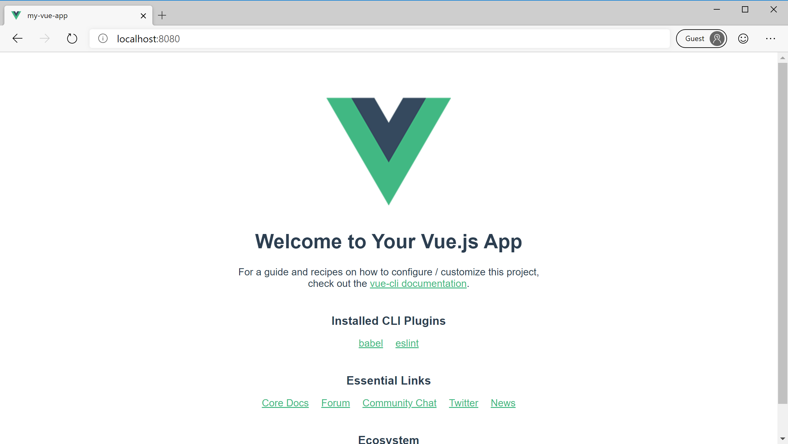

# Create the app

[Previous step: Introduction and prerequisites](tutorial-vscode-static-website-node-01.md)

In this step, you use the Command Line Interface (CLI) for [Angular](https://cli.angular.io/), [React](https://github.com/facebook/create-react-app) or [Vue](https://cli.vuejs.org/) to create a simple app that can be deployed to Azure. You can alternately use any other JavaScript framework that produces a set of static files, or any folder that contains HTML, CSS or JavaScript files. If you already have an app ready to deploy, you can skip ahead to [Create an Azure Storage account](tutorial-vscode-static-website-node-03.md).

# [Angular](#tab/angular)

[!INCLUDE [tutorial-vscode-static-scaffold](includes/tutorial-vscode-static-scaffold.md)]

```bash
npx @angular/cli new my-static-app
```

When the CLI asks any configuration questions, press enter to select the default options.

[!INCLUDE [tutorial-vscode-static-build](includes/tutorial-vscode-static-build.md)]

1. You should now have a _dist_ folder in the _my-static-app_ folder. Inside that _dist_ folder, there will be a folder with the same name as your project - _my-static-app_. The _build/my-static-app_ folder contains the HTML, CSS, and JavaScript files that you deploy to Azure Storage.

[!INCLUDE [tutorial-vscode-static-run](includes/tutorial-vscode-static-run.md)]

1. Open a browser to [http://localhost:3000](http://localhost:3000) to verify that the app is running:

   

[!INCLUDE [tutorial-vscode-static-stop](includes/tutorial-vscode-static-stop.md)]

# [React](#tab/react)

[!INCLUDE [tutorial-vscode-static-scaffold](includes/tutorial-vscode-static-scaffold.md)]

```bash
npx create-react-app my-static-app
```

[!INCLUDE [tutorial-vscode-static-build](includes/tutorial-vscode-static-build.md)]

1. You should now have a _build_ folder in the _my-static-app_ folder. The _build_ folder contains the HTML, CSS, and JavaScript files that you deploy to Azure Storage.

[!INCLUDE [tutorial-vscode-static-run](includes/tutorial-vscode-static-run.md)]

1. Open a browser to [http://localhost:3000](http://localhost:3000) to verify that the app is running:

   

[!INCLUDE [tutorial-vscode-static-stop](includes/tutorial-vscode-static-stop.md)]

# [Vue](#tab/vue)

[!INCLUDE [tutorial-vscode-static-scaffold](includes/tutorial-vscode-static-scaffold.md)]

```bash
npx @vue/cli create my-static-app
```

When the CLI asks any configuration questions, press enter to select the default options.

[!INCLUDE [tutorial-vscode-static-build](includes/tutorial-vscode-static-build.md)]

1. You should now have a _dist_ folder in the _my-static-app_ folder. The _dist_ folder contains the HTML, CSS, and JavaScript files that you deploy to Azure Storage.

1. Run the app by using the following command:

   ```bash
   npm run serve
   ```

1. Open a browser to [http://localhost:8080](http://localhost:8080) to verify that the app is running:

   

[!INCLUDE [tutorial-vscode-static-stop](includes/tutorial-vscode-static-stop.md)]

---

> [!div class="nextstepaction"][i created the app](tutorial-vscode-static-website-node-03.md) [I ran into an issue](https://www.research.net/r/PWZWZ52?tutorial=node-deployment-staticwebsite&step=create-app)
