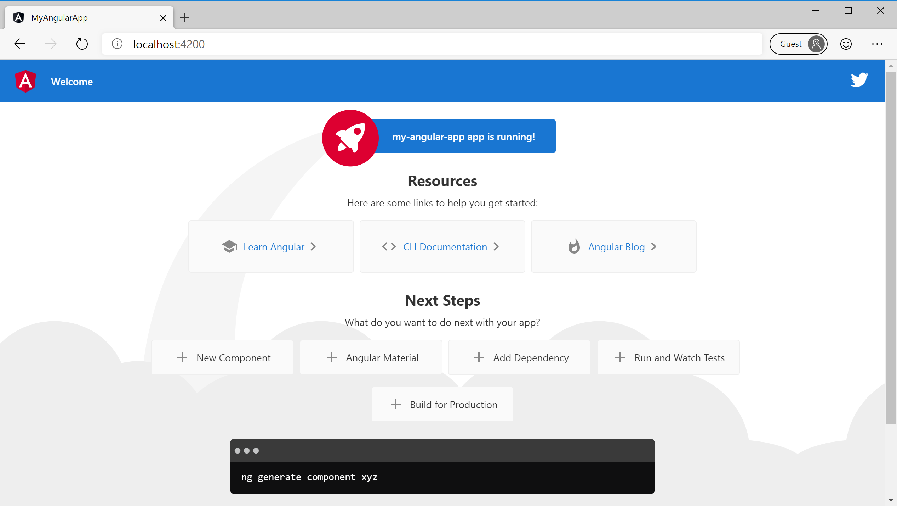
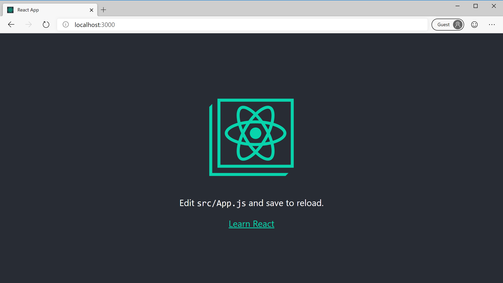

# Create the app

[Previous step: Introduction and prerequisites](tutorial-vscode-static-website-node-01.md)

In this step, you use the Command Line Interface (CLI) for [Angular](https://cli.angular.io/), [React](https://github.com/facebook/create-react-app), [Vue](https://cli.vuejs.org/) or [Svelte](https://github.com/sveltejs/template) to create a simple app that can be deployed to Azure. You can alternately use any other JavaScript framework that produces a set of static files, or any folder that contains HTML, CSS or JavaScript files. If you already have an app ready to deploy, you can skip ahead to [Create an Azure Storage account](tutorial-vscode-static-website-node-03.md).

# [Angular](#tab/angular)

1. Use the CLI to scaffold out a new app called "my-static-app" by running the following command:

    ```bash
    npx @angular/cli new my-static-app
    ```

    When the CLI asks any configuration questions, press enter to select the default options.

1. Build the application by switching to the new folder and running `npm run build`:

    ```bash
    cd my-static-app
    npm run build
    ```

1. You should now have a _dist_ folder in the _my-static-app_ folder. Inside that _dist_ folder, there will be a folder with the same name as your project - _my-static-app_. The _build/my-static-app_ folder contains the HTML, CSS, and JavaScript files that you deploy to Azure Storage.

1. Run the app by using the following command:

    ```bash
    npm start
    ```

1. Open a browser to [http://localhost:4200](http://localhost:4200) to verify that the app is running:

    

1. Stop the server by pressing **Ctrl**+**C** in the terminal or command prompt.

# [React](#tab/react)

1. Use the CLI to scaffold out a new app called "my-static-app" by running the following command:

    ```bash
    npx create-react-app my-static-app
    ```

1. Build the application by switching to the new folder and running `npm run build`:

    ```bash
    cd my-static-app
    npm run build
    ```

1. You should now have a _build_ folder in the _my-static-app_ folder. The _build_ folder contains the HTML, CSS, and JavaScript files that you deploy to Azure Storage.

1. Run the app by using the following command:

    ```bash
    npm start
    ```

1. Open a browser to [http://localhost:3000](http://localhost:3000) to verify that the app is running:

    

1. Stop the server by pressing **Ctrl**+**C** in the terminal or command prompt.

# [Vue](#tab/vue)

1. Use the CLI to scaffold out a new app called "my-static-app" by running the following command:

    ```bash
    npx @vue/cli create my-static-app
    ```

When the CLI asks any configuration questions, press enter to select the default options.

1. Build the application by switching to the new folder and running `npm run build`:

    ```bash
    cd my-static-app
    npm run build
    ```

1. You should now have a _dist_ folder in the _my-static-app_ folder. The _dist_ folder contains the HTML, CSS, and JavaScript files that you deploy to Azure Storage.

1. Run the app by using the following command:

     ```bash
     npm run serve
     ```

1. Open a browser to [http://localhost:8080](http://localhost:8080) to verify that the app is running:

    

1. Stop the server by pressing **Ctrl**+**C** in the terminal or command prompt.

# [Svelte](#tab/svelte)

1. Use the CLI to scaffold out a new app called "my-static-app" by running the following command:

    ```bash
    npx degit sveltejs/template my-static-app
    ```

1. Then, go to the new folder and running `npm install` command:

    ```bash
    cd my-static-app
    npm install
    ```

1. Let's build the application running `npm run build` command:

    ```bash
    npm run build
    ```

1. You should now have a _build_ folder inside the folder _public_. The _build_ folder contains the HTML, CSS, and JavaScript files that you deploy to Azure Storage.

1. Run the app by using the following command:

     ```bash
     npm run dev
     ```

1. Open a browser to [http://localhost:5000](http://localhost:5000) to verify that the app is running:

    

1. Stop the server by pressing **Ctrl**+**C** in the terminal or command prompt.

---

> [!div class="nextstepaction"]
> [I created the app](tutorial-vscode-static-website-node-03.md) [I ran into an issue](https://www.research.net/r/PWZWZ52?tutorial=node-deployment-staticwebsite&step=create-app)
