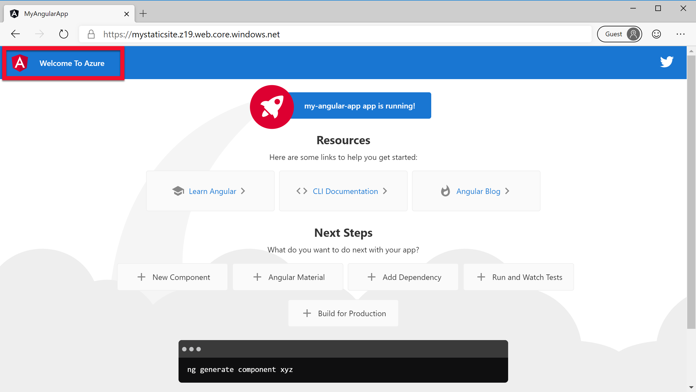
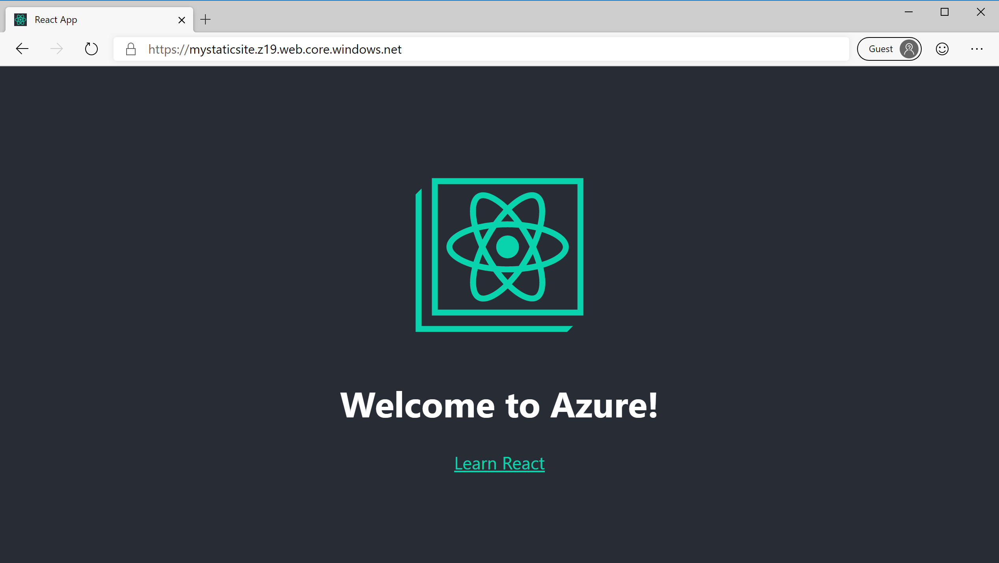
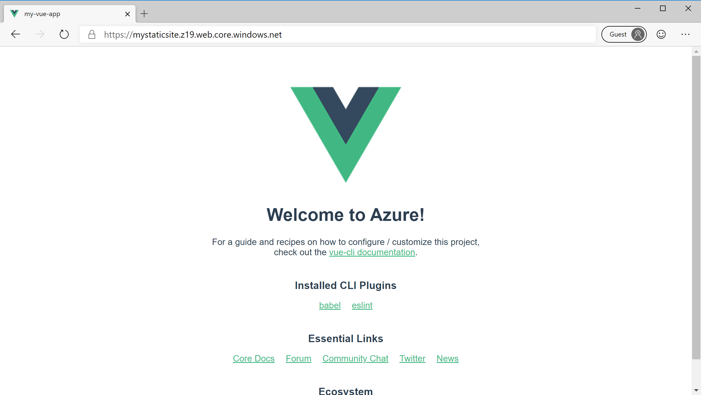

# Make changes and redeploy

[Previous step: Deploy to Azure Storage](tutorial-vscode-static-website-node-04.md)

In this step, you make a simple change to the app's source code and redeploy the site to experience the end-to-end deployment workflow.

# [Angular](#tabs/angular)

1. In Visual Studio Code, open the _src/app/app.component.html_ file and change line 305 to match the following:

   ```html
   <span>Welcome To Azure</span>
   ```

[!INCLUDE [tutorial-vscode-static-rebuild](/includes/tutorial-vscode-static-rebuild.md)]

1. In VS Code, right-click your updated _dist/my-static-site_ folder and again choose **Deploy to Static Website**. Choose your Storage account and confirm that you want to deploy your changes. (The Azure extension automatically deletes old files before deploying changes to avoid caching issues.)

[!INCLUDE [tutorial-vscode-static-refresh](/includes/tutorial-vscode-static-refresh.md)]



# [React](#tabs/react)

1. In Visual Studio Code, open the _src/app.js_ file change line 11 to match the following:

   ```js
   <h1 className="App-title">Welcome to Azure!</h1>
   ```

[!INCLUDE [tutorial-vscode-static-rebuild](/includes/tutorial-vscode-static-rebuild.md)]

1. In VS Code, right-click your updated _build_ folder and again choose **Deploy to Static Website**. Choose your Storage account and confirm that you want to deploy your changes. (The Azure extension automatically deletes old files before deploying changes to avoid caching issues.)

[!INCLUDE [tutorial-vscode-static-refresh](/includes/tutorial-vscode-static-refresh.md)]



# [Vue](#tabs/vue)

1. In Visual Studio Code, open the _src/App.vue_ file change line 11 to match the following:

   ```html
   <HelloWorld msg="Welcome to Azure!" />
   ```

[!INCLUDE [tutorial-vscode-static-rebuild](/includes/tutorial-vscode-static-rebuild.md)]

1. In VS Code, right-click your updated _dist_ folder and again choose **Deploy to Static Website**. Choose your Storage account and confirm that you want to deploy your changes. (The Azure extension automatically deletes old files before deploying changes to avoid caching issues.)

[!INCLUDE [tutorial-vscode-static-refresh](/includes/tutorial-vscode-static-refresh.md)]



---

> [!div class="nextstepaction"][i deployed changes](tutorial-vscode-static-website-node-06.md) [I ran into an issue](https://www.research.net/r/PWZWZ52?tutorial=node-deployment-staticwebsite&step=code-change)
