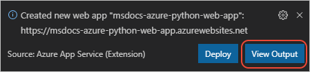
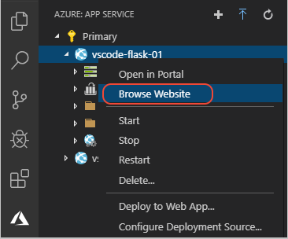

# Create the App Service

[Previous step: prerequisites](tutorial-deploy-app-service-on-linux-01.md)

1. In the **Azure: App Service** explorer, select the **+** command to create a new App Service, or open the Command Palette (**F1**) and select **Azure App Service: Create New Web App**. (In App Service terminology, a "web app" is a **host** for web app code, not the app code itself.)

    

1. In the prompts that follow:

    - Enter a name for your app, which must be globally unique on App Service; typically you use your name or company name followed by the app name.
    - Select **Linux** for the operating system.
    - Select **[Preview] Python 3.7** as the runtime.

1. After a short time you see a message that the new App Service was created, along with the question **Deploy to web app?**. Answer **No** at this point because you need to change the deployment source to Git. Otherwise the "Deploy to Web App" command only copies your files to the server using a ZIP file and doesn't install your dependencies.

    

1. To confirm that the App Service is running properly, expand your subscription in the **Azure: App Service** explorer, right-click the App Service name, and select **Browse website**:

    

1. Because you haven't deployed your own code to the App Service yet, you should see only the default app:

    

## (Optional) Upload an environment variable definitions file

If you have an [environment variable definitions file](environments.md#environment-variable-definitions-file) (typically with the *.env* extension), you can use that file to configure the App Service environment as well:

1. In the **Azure: App Service** explorer, expand the node for the desired App Service, then right-click the **Application Settings** node and select **Upload Local Settings**.

1. VS Code prompts you for the location of your *.env* file, then uploads it to the App Service.

1. Once the upload is complete, you can expand the **Application Settings** node to see the individual values. You can also view them on the Azure portal by navigating to the App Service and selecting **Configuration**.

1. If you create settings directly on the Azure portal, you can save them in a definitions file by right-clicking the **Application Settings** node and selecting **Download Remote Settings**. This process makes sure that you have those settings in your repository and not only on the portal.

> [!div class="nextstepaction"]
> [Next: Create the App Service](tutorial-deploy-app-service-on-linux-03.md) [I ran into an issue](https://www.research.net/r/PWZWZ52?tutorial=vscode-appservice&step=02-create-app-service)
