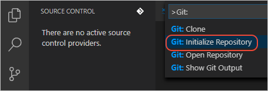
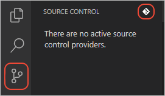
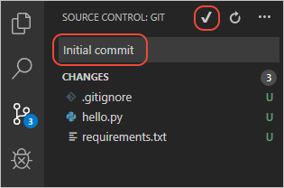

# Add the app to a Git repository

[Previous step: configure a custom startup file](tutorial-deploy-app-service-on-linux-03.md)

As noted earlier, you must deploy to App Service on Linux using Git in order for the container to install your dependencies in *requirements.txt*. The following steps make sure you have both a *requirements.txt* file and a repository:

1. Create a *requirements.txt* file in your root folder if you don't have one already:

    1. Activate your virtual environment with the **Python: Select Interpreter** command on the **Command Palette** (**F1**)).
    1. Open a terminal for the environment with **Terminal: Create New Integrated Terminal**.
    1. Make sure you're in the root folder of the app, then run `pip freeze > requirements.txt`.

    > **Tip**: be sure to place *requirements.txt* in the root folder, otherwise App Service won't find it and won't automatically install your dependencies.

1. In your project folder, create a file named *.gitignore* with the following contents (change *.venv* if you're using a different folder for a virtual environment):

    ```gitignore
    .vscode/
    __pycache__
    .venv/
    ```

1. From the **Command Palette** (**F1**), run the **Git: Initialize Repository** command.

    

    The same command is found at the top of the **Source Control** explorer:

    

1. In the prompt that appears, select your current folder for the repository, then answer **Open Repository** in the subsequent message"

    

    

1. In the Source Control explorer, you see your project files ready to commit to the repository. Enter a commit message like "Initial commit", then select the checkmark button:

    

> [!div class="nextstepaction"]
> [Next: Deploy your app using Git](tutorial-deploy-app-service-on-linux-05.md) [I ran into an issue](https://www.research.net/r/PWZWZ52?tutorial=vscode-appservice&step=04-add-to-git)
