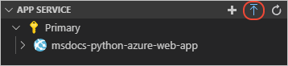
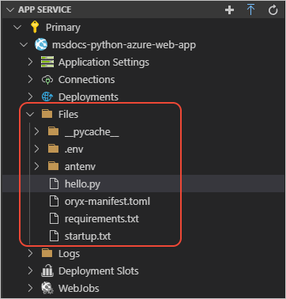

# Tutorial: Deploy your Python web app to Azure App Service on Linux

[Previous step: configure a custom startup file](tutorial-deploy-app-service-on-linux-04.md)

Use this procedure to deploy your Python app to an Azure App Service.

1. In Visual Studio Code, open the **Azure: App Service** explorer and select the blue up arrow:

   

    Alternately, you can right-click the App Service name and select the **Deploy to Web App** command.

1. In the prompts that follow, provide the following details:

    - For "Select the folder to deploy," select your current app folder.
    - For "Select Web App," choose the App Service you created in the previous step.

1. While the deployment process is underway, you can view progress in the VS Code **Output** window.

    

1. When deployment is complete after a few minutes (depending on how many dependencies need to be installed), the message below appears. Select the **Browse Website** button to view the running site.

    

    

1. To verify that your files are deployed, expand the App Service in the **Azure: App Service** explorer, then expand **Files**:

    

    The *antenv* folder is where App Service creates a virtual environment with your dependencies. If you expand this node, you can verify that the packages you named in *requirements.txt* are installed in *antenv/lib/python3.7/site-packages*.

> [!div class="nextstepaction"]
> [I deployed my app](tutorial-deploy-app-service-on-linux-06.md)

[I ran into an issue](https://www.research.net/r/PWZWZ52?tutorial=vscode-appservice-python&step=05-deploy-app)
