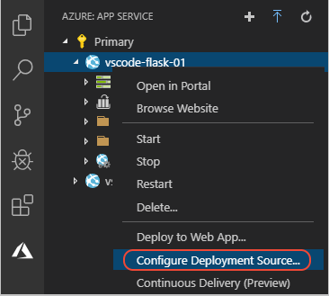
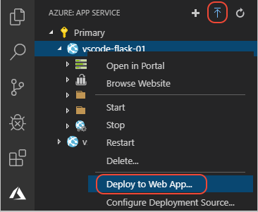
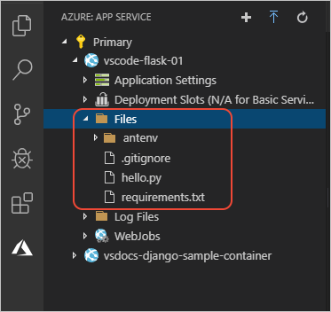
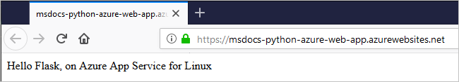

# Deploy your app using Git

[Previous step: add the app to a Git repository](tutorial-deploy-app-service-on-linux-04.md)

As mentioned earlier, you must use Git to deploy Python apps to App Service on Linux so that your dependencies in *requirements.txt* are installed. With Git deploy you can use either a local repository or a GitHub repository.

1. Make sure all your code changes are committed to your repository, and pushed to GitHub if you're using that option.

1. In the **Azure: App Service** explorer, right-click the App Service name, and select **Configure Deployment Source**:

    

1. When prompted, choose either **LocalGit** or **GitHub** as the source:

    - **LocalGit**: code is deployed from the currently active branch of your local copy of the repository.

    - **GitHub**: code is deployed from the selected branch of a GitHub repository, and happens automatically when you push commits to the repository. Selecting this option successively prompts you for the organization, repository, and branch to use.

1. With both choices, the extension connects the App Service to the repository. You don't see indications of the connection in VS Code itself; on the Azure portal, you can examine the connect on the Azure portal in the App Service's **Deployment Center** page.

1. To shorten deployment time, you can exclude VS Code files and your virtual environment by adding the following lines to the *.vscode/settings.json* file (replace *.env* with your particular virtual environment folder):

    ```json
    "appService.zipIgnorePattern": [
        ".vscode{,/**}",
        ".env{,/**}"
    ],
    ```

1. To deploy the app:

    - **LocalGit**: Commit your changes to your local repository, then right-click the App Service again, select **Deploy to Web App**, and select the project folder when prompted. (You can also select the deploy button at the top of the explorer.)

        

    - **GitHub**: Commit your changes, then do a Git push by selecting **Git: Push** from the Command Palette or by using the sync changes button on the status bar:

        

1. While deployment is taking place, you see an indicator in the App Service extension explorer:

    

    You can also observe progress in the **Output** panel (**Ctrl**/**Cmd** + **Shift** + **U**) by selecting **Azure App Service** from the drop-down:

    

1. After a minute or two (depending on how many dependencies are in your *requirements.txt*), VS Code reports that deployment is complete. To verify that your files are deployed, expand the App Service in the **Azure: App Service** explorer, then expand **Files**:

    

    The *antenv* folder is where App Service creates a virtual environment with your dependencies. If you expand this node, you can verify that the packages you named in *requirements.txt* are installed in *antenv/lib/python3.7/site-packages*.

1. Right-click the App Service again and select **Browse Website** to view your running app (you may need to refresh the browser if the previous page was cached):

    

> [!div class="nextstepaction"]
> [Next: Make changes and redeploy](tutorial-deploy-app-service-on-linux-06.md) [I ran into an issue](https://www.research.net/r/PWZWZ52?tutorial=vscode-appservice-python&step=05-deploy-with-git)
